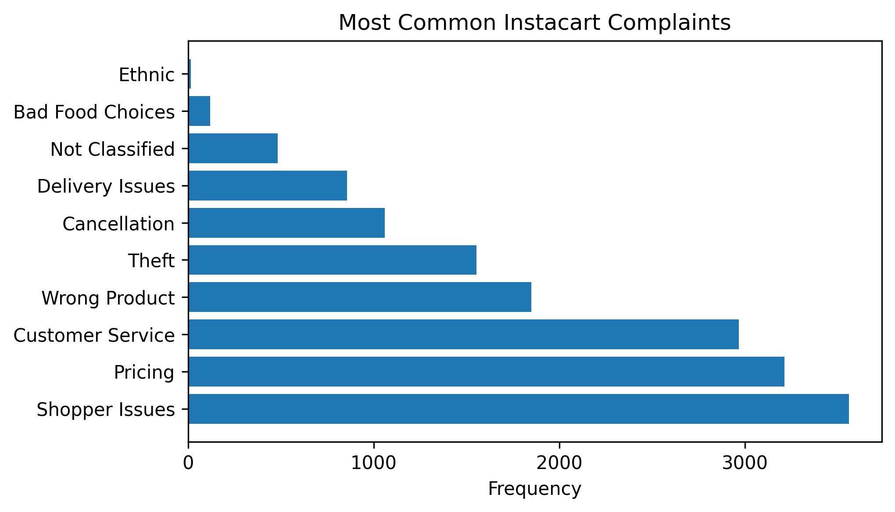

# instacart-webscraper
This program is a webscraper created to gather data for a consulting challenge with Instacart, a grocery delivery and pickup service. My team's goal was to improve the shopping experience for Instacart customers.

Our Webscraper is a Python program that scraped over 5000 one-star reviews from [Trustpilot](https://ca.trustpilot.com/review/instacart.com?stars=1) and [Sitejabber](https://www.sitejabber.com/reviews/instacart.com#reviews). We only analyzed one-star reviews because our intent was to determine the main problems customer's have with the Instacart.

Our program classifies the reviews into appropriate categories. After our preliminary research, we determined seven core issues that we wanted to look for in our reviews:

* **Pricing:** This refers to all issues customers have with Instacart's pricing.
* **Wrong Product:** This refers to occassions when the customer did not receive the product they wanted, often due to poor substitution choices
* **Theft:** This category involves situations when the shopper stole the customers groceries. It is important to note, however, that some of these instances may be situations where the customer *thought* the shopper stole groceries, when in reality some products were simply missing.
* **Cancellation:** Occassions when the customer's order was cancelled.
* **Delivery Issues:** This category generally refers to instances when the customer's order arrived late. However, it also includes situations when the shopper did not follow the customer's instructions.
* **Customer Service:** Issues relating to Instacart's customer service department.
* **Bad Food Choices:** Instances when the shopper chose bad groceries, which may be spoiled, rotten, expired, etc.

We also have a **Shopper Issues** category, which includes all reviews that would fit into the Wrong Product, Theft, Cancellation, Delivery Issues, and Bad Food Choices categories. We made this category to analyze the portion of reviews that had issues that could have been solved with better shoppers.

> Note that each time the program is run, the data might be slightly different. This is because reviews are constantly added to these websites, causing the data from one day to be slightly different from the data for the next day. However, the distribution and percentages will most likely remain in the same ballpark.
